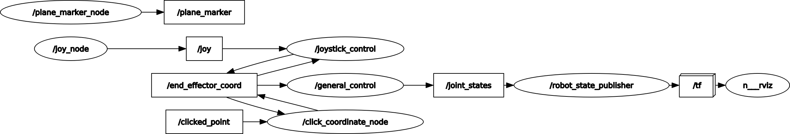
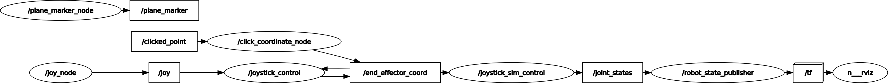

# DOBOT Magician ROS Controllers
This is a digital twin ROS package for the DOBOT [Magician](https://www.dobot-robots.com/products/education/magician.html) robotic arm. It provides a simple interface to control the robot arm. The package has been tested with ROS Noetic on Ubuntu 20.04.


## Usage
Steps to run the package:
1. Navigate to this directory in the terminal.
2. Run `catkin_make` to build the package.
3. Run `source devel/setup.bash` before running the following commands.

### Digital Twin


```bash
# Terminal 1
roslaunch magician display.launch
```
```bash 
# Termianal 2
# Connect the dobot magician and a joystick to the computer
sudo chown -R $USER:$USER /dev/ttyACM*
roslaunch magician_control joystick-real.launch
```
- Use the joystick to control the real robot arm's end effector coordinate. Can also use buttons on the joystick to home the robot arm and toggle the gripper.
- In RViz, press the `c` shortcut key to enable the `Publish Point` tool. Click on the green plane to set a target position for the end effector.
- The simulation robot arm will be in sync with the real robot arm (two-way joint state communication).

### Simulation - Joystick Control

```bash
# Terminal 1
roslaunch magician display.launch
```
```bash
# Terminal 2
# Connect a joystick to the computer
roslaunch magician_control joystick-sim.launch
```
- Use the joystick to control the sim robot arm's joint angles.

### Sim to Real - for testing purposes only
One-way joint state communication between sim and real
#### Mode 1
```bash
# Terminal 1
roslaunch magician display.launch
```
```bash
# Terminal 2
# Connect the dobot magician to the computer
sudo chown -R $USER:$USER /dev/ttyACM*
rosrun magician_control joint_state_feedback.py
```
- The simulated robot arm will mirror the real robot arm's joint angles.

#### Mode 2
- Uncomment the `joint_state_publisher_gui` OR `slidebar_sim_joint_state` node under src/magician-master/launch/display.launch
```bash
# Terminal 1
roslaunch magician display.launch
```
```bash
# Terminal 2
# Connect the dobot magician to the computer
sudo chown -R $USER:$USER /dev/ttyACM*
rosrun magician_control joint_state_controller.py
```
- The real robot arm will mirror the simulated robot arm's joint angles.

## Development Environment
This package has been developed and tested on the following environment:
- Ubuntu 20.04
- ROS Noetic (ROS1)
- Python 3.8.10
